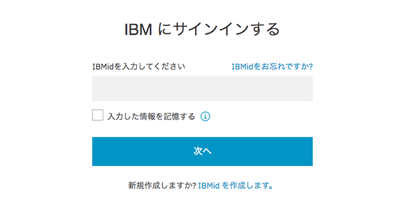
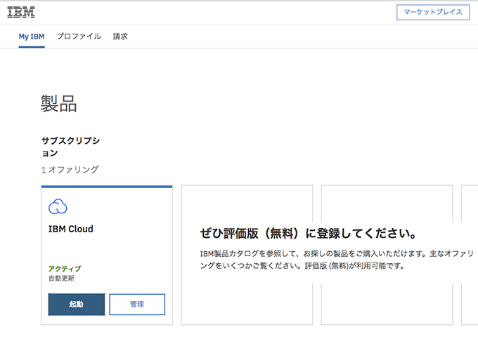
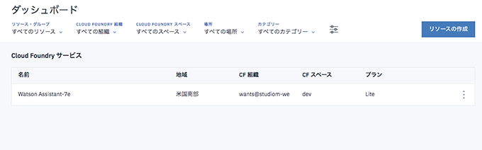
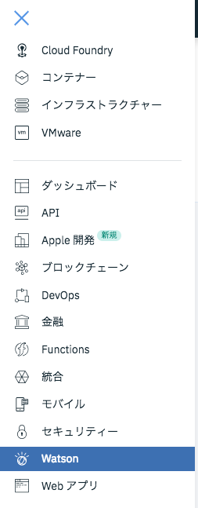
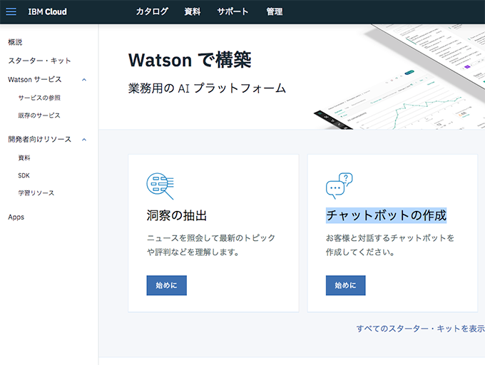
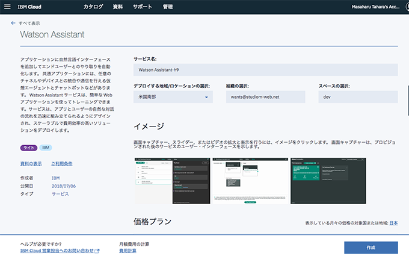
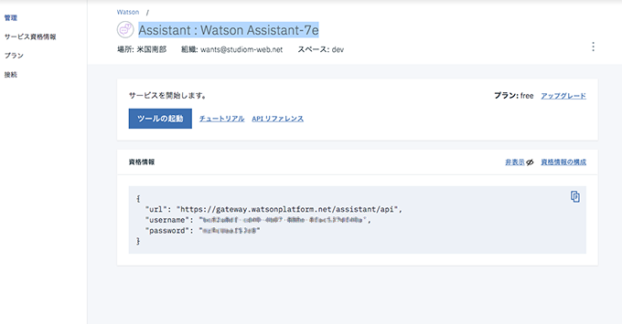
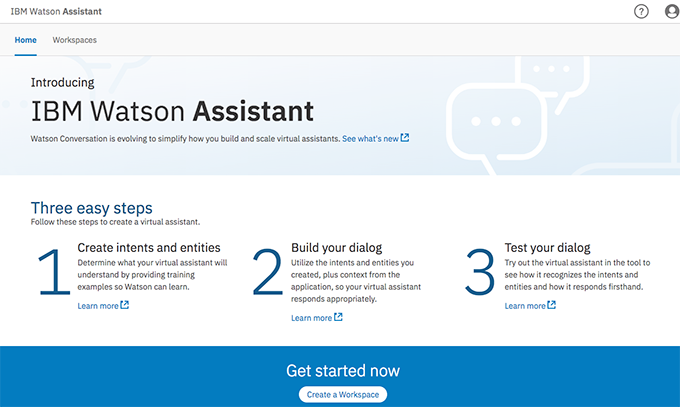
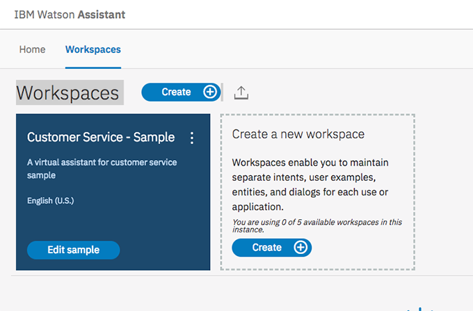
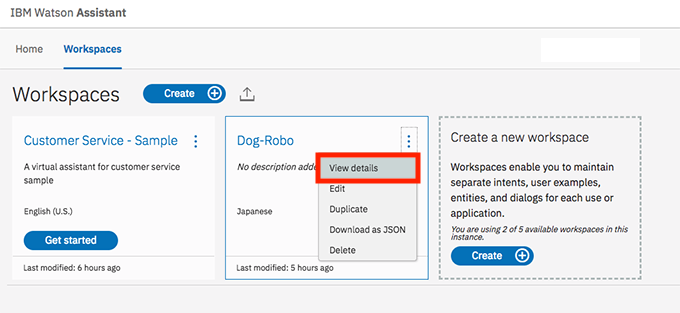

# WatsonでBot作成
## チャットボットの活用方法
出来上がったチャットボットはこちらで簡単に活用できそうです。

[WordpressにIBM Watsonのチャットボット機能を実装してみた](https://qiita.com/asasaki/items/18a7535b759de86841ea)
## 準備

ダッシュボードにアクセスするには以下アドレス。
IBMidが無い場合は新規作成します。

https://myibm.ibm.com/dashboard/ 
ダッシュボードにサインインする。 
* IBMidは登録したメールアドレスのこと。
* パスワードは登録時に作成したパスワード



Productsのページが開きます。  


* 英語で開いたら下部右側に言語切り替えがあるので「Japan-Japanese」を選びます。

* IBM Cloudのカラムの中の「起動」ボタンをクリックします。

これでダッシュボードが表示されます。


* 左上のハンバーガーメニューを開き、出てきたメニューの「watson」を選択。


* 「Watsonで構築ページ」で「チャットボットの作成」の「始めに」ボタンをクリックします。


Watson Assistantページが開かれます。


サービス名は勝手に名前が付きます。（今回はWatson Assistant-7eとなった）  
* デプロイする場所は米国南部
* 組織の選択は登録したメールアドレス
* 価格プランがライトになっていることを確認

* 一番下の「作成」ボタンをクリック

Assistant : サービス名のページが開きます。


「サービスを開始します」のチュートリアルでまず学習しておきましょう。

「Watson Assistantの概説チュートリアル」
を開いておくとこれから作業を進める上で助かります。

## 開発中のサービスにアクセス
すでに一度サービスを作成して開発中のサービスに移動するにはダッシュボードにサービス名が表示されていますので、そこをクリックすれば行けます。  
サービス名の変更は右のみたらし団子をクリックするとメニューがあります。

## 機械学習
資格情報の構成 ...表示をクリックするとユーザー名とパスワードを見ることができる。
```
資格情報の構成
{
  "url": "https://gateway.watsonplatform.net/assistant/api",
  "username": "•••••••••••••••••••••••••",
  "password": "••••••••••••"
}
```

* 「ツールの起動」ボタンをクリック


IBM Watson Assistantページが表示されます。
ここから英語のページになります。


* 「Create Workspace」ボタンをクリック

Workspacesページが開きます。


ここからは。[「Watson Assistantの概説チュートリアル」](https://console.bluemix.net/docs/services/conversation/getting-started.html#getting-started-tutorial)を参考にして進めます。

### インテントの作成

インテントは、ユーザーの入力の目的を表します。  
この例では、分かりやすくするために 2 つのインテントのみを定義します。「こんにちは」と言うインテントと、「さようなら」と言うインテントです。

「Intents」タブが表示されていることを確認します。 (ワークスペースを作成したところであれば、既に表示されているはずです。)
「インテントの追加 (Add intent)」をクリックします。

インテントに hello という名前を付けてから、「インテントの作成 (Create intent)」をクリックします。  
「ユーザー例の追加 (Add user example)」フィールドに「こんにちは (hello)」と入力して、Enter キーを押します。

 intentが多ければ多いほど、サービスはユーザーのインテントをいっそう正確に認識できるようになります。  
次のものを追加します。
* おはよう
* おはようございます
* こんにちは
* やあ
「閉じる」 閉じる矢印 アイコンをクリックして、#hello インテントの作成を終了します。

### カタログからインテントを追加する
カタログからインテントを追加して、IBM によって作成されたトレーニング・データをワークスペースに追加します。特に、「ビジネス情報 (Business Information)」カタログへのアクセス権をアシスタントに付与して、会社の連絡先情報を求めるユーザーの要求にダイアログが対応できるようにします。

* Watson Assistant ツールで、「カタログ (Content Catalog)」タブをクリックします。
* リスト内で「カスタマー・ケア　ビジネスに関する情報を理解し、お客様を支援する」を見つけて、「ボットに追加 (Add to workspace)」をクリックします。
* 「インテント (Intents)」タブを開き、トレーニング・データに追加されたインテントと、関連付けられている発話例を確認します。各インテント名の先頭は接頭部 #Customer_Care_ なので、それらを認識することができます。後のステップで、#Customer_Care_ _Contact_Us インテントをダイアログに追加します。

これでIBM が提供している事前作成済みのコンテンツを使用して、トレーニング・データを正常に補足しました。

### 対話を作成する
対話とは、論理ツリー形式で会話の流れを定義したものです。 ツリーの各ノードには、ユーザーの入力に基づいてトリガーとなる、条件があります。

これから、#hello インテントと #goodbye インテントを処理するシンプルな対話を作成します。

開始ノードの追加  
* Watson Assistant ツールで、「Dialog」タブをクリックします。
* 「Create」をクリックします。 2 つのノードが表示されます。
* Welcome: ユーザーがボットとのやり取りを開始するときに表示される、あいさつが入ります。
* Anything else: ユーザーの入力が認識されないときにユーザーへの応答に使用するフレーズが入ります。


### 開始ノードの追加
Watson Assistant ツールで、「Dialog」タブをクリックします。
「Create」をクリックします。 2 つのノードが表示されます。

* Welcome: ユーザーがボットとのやり取りを開始するときに表示される、あいさつが入ります。
* Anything else: ユーザーの入力が認識されないときにユーザーへの応答に使用するフレーズが入ります。
* Welcome ノードと Anything else ノードからなる対話ツリーを表示

* Welcome ノードをクリックして、編集ビューで開きます。
デフォルトの応答を、Watson Assistant チュートリアルへようこそ! というテキストに置き換えます。
* Close をクリックして、編集ビューを閉じます。

### インテントを処理するノードの追加
Welcome ノードと Anything else ノードの間に、インテントを処理するためのノードを追加します。

* Welcome ノードの詳細アイコン 詳細オプション をクリックし、「Add node below」を選択します。  
このノードの 「Enter a condition」フィールドに #hello と入力します。 それから、#hello オプションを選択します。
* 応答として 良い一日を。 を追加します。

Close をクリックして、編集ビューを閉じます。

* このノードの詳細アイコン 詳細オプション をクリックし、「Add node below」を選択してピア・ノードを作成します。 ピア・ノードで、#Business_Information_Contact_Us を条件として指定します。
* 次のテキストを応答として追加します。

* 800-426-4968 にお電話いただくか、https://www.ibm.com/scripts/contact/contact/ja/jp にご意見をお寄せください。

* このノードの「詳細 (More)」アイコン 詳細 (More) オプション をクリックし、「下記のノードを追加 (Add node below)」を選択して別のピア・ノードを作成します。ピア・ノードで、#goodbye を条件に指定し、またお会いしましょう! を応答に指定します。

### インテントの認識のテスト
hello 入力と goodbye 入力の両方を認識して応答する、単純な対話を作成しました。 これから、正しく機能することを確認します。

* Ask Watson アイコンをクリックして、「Try it out」ペインを開きます。 例のウェルカム・メッセージが表示されます。
* ペインの下部で こんにちは と入力し、Enter キーを押します。 #hello インテントが認識されたことが出力に示され、該当する応答 (良い一日を。) が表示されます。

以下の入力を試してください。

バイバイ
やあ
またね
おはよう
さよなら

* 「質問がある場合の電話連絡先 (Who can I call if I have questions?)」と入力して、Enter キーを押します。#Business_Information_Contact_Us インテントが認識されたことが出力に示され、このインテント用に追加した応答が表示されます。
* Watson は、入力内容が、提供されていたサンプルと完全に一致していなくても、インテントを認識できます。 対話ではインテントにより、使用される厳密な言葉遣いに関係なくユーザーの入力の目的を識別します。そして、指定された方法で応答します。


## WordPressにプラグインを使ってbot導入
これを使うとコードを書く必要がありません。
「Watson Assistant」を新規プラグインで導入。
インストール後に有効化して設定。

Username/Passwordを選択して「Username」、「Password」を入力します。この情報はサービスのページに表示される資格情報を使います。


Workspace URLは次のアドレスです。  
[ここはWorkspace ID]部分はConversationのワークスペースのView detailsを選択すると表示されます。
```
https://gateway.watsonplatform.net/assistant/api/v1/workspaces/[ここはWorkspace ID]/message/
```


入力を間違うと保存できません。
設定がうまくいくとWordPressのページにbotが表示されるようになります。